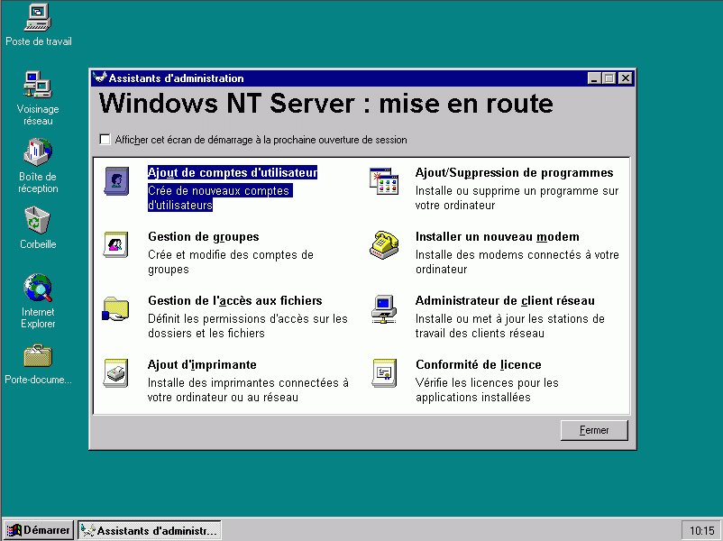
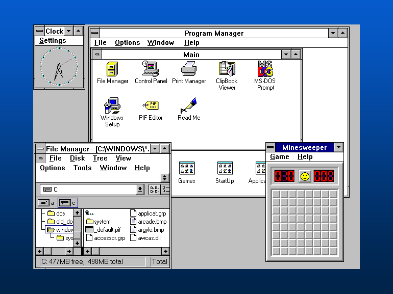
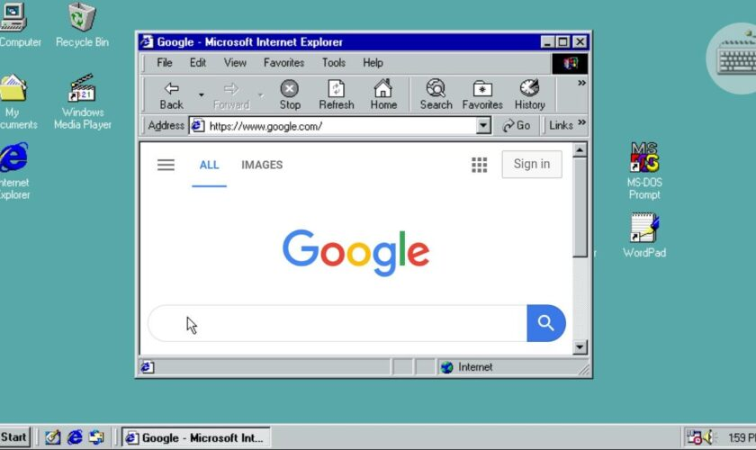
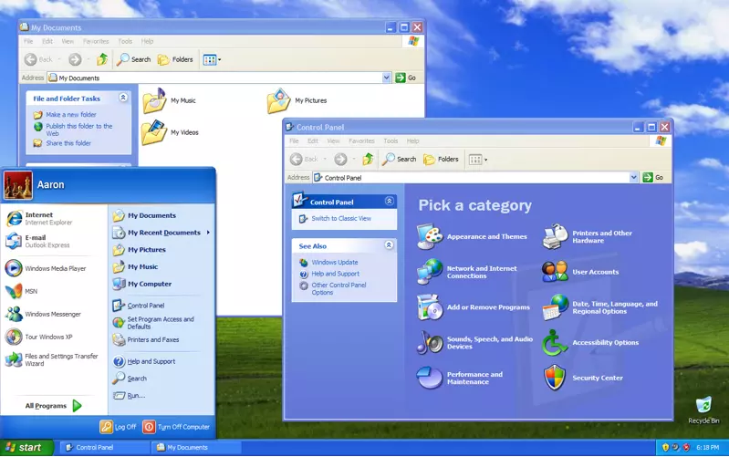
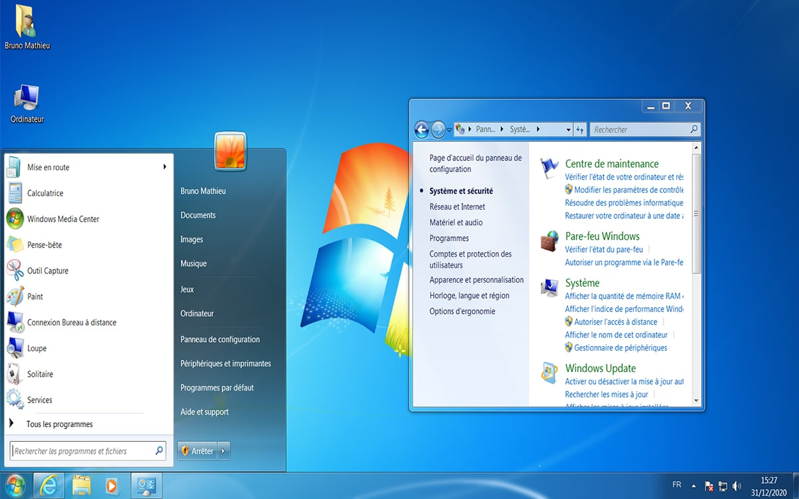
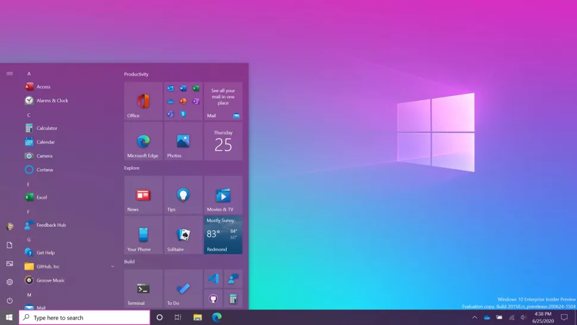
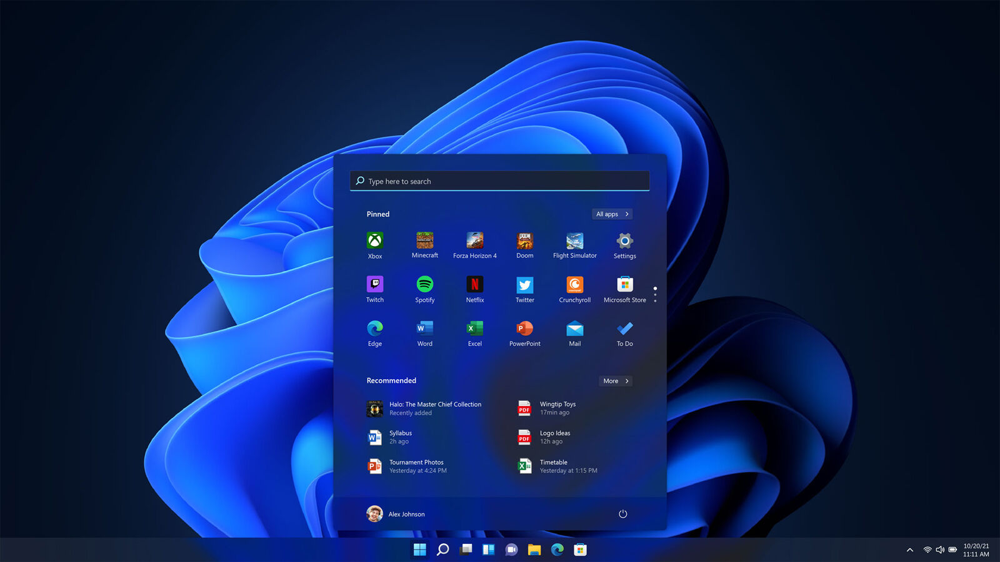

# Microsoft Windows

## Mais qu'est-ce que Windows ?

Tout d'abord, Microsoft Windows est un OS (pour Operating System aka Système d'exploitation), c'est-à-dire un ensemble de programme chargé d'établir une relation entre les différentes ressources matérielles, les applications et l'utilisateur, développé par l'entreprise Microsoft (Merci Wiki 😁). En d'autres mots, il sert de hub pour faire fonctionner votre ordinateur.

Windows était une GUI (Pour Graphical User Interface, Interface Graphique Utilisateur) pour l'ancien OS de Microsoft nommé MS-DOS 👇, 

.png)

avant de devenir un OS à part entière basé sur Windows NT (Développer pour OS/2, une collaboration IBM / Microsoft) 👇

## Les différentes versions principales de Windows

- Windows 3.1
- Windows 95
- Windows 98
- Windows 2000
- Windows ME
- Windows XP
- Windows Vista
- Windows 7
- Windows 8
- Windows 10
- Windows 11

:::: code-group
::: code-group-item Windows 3.1

:::
::: code-group-item Windows 98

:::
::: code-group-item Windows XP

:::
::: code-group-item Windows 7

:::
::: code-group-item Windows 10

:::
::: code-group-item Windows 11

:::
::::

**Dans la suite je vous montrerais, selon moi, comment on utilise Windows 10 / 11 au mieux, ou en tout cas de bonnes pratiques d'utilisations**