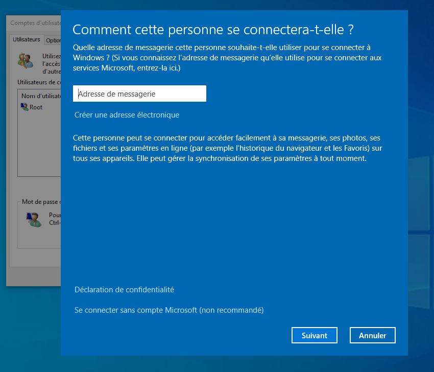

# Microsoft Windows - Paramétrage

## Premier démarrage de Windows

Grosso modo, le style des fenêtres changera suivant les versions, mais on vous demandera exactement la même chose.

### Création du premier utilisateur

Sous Windows, le premier utilisateur créé, est toujours Administrateur de la machine. Ce qui, on en convient, est un sacré souci de sécurité. On ne se connectera jamais ou que très rarement à celui-ci.

Oui, je créé mon administrateur à la linuxienne.

### Création d'un second utilisateur
#### Par les paramètres de Windows 10
Nous allons créé un second utilisateur qui n'aura cette fois-ci pas les droits d'administration.

:::: code-group
::: code-group-item Etape 1

:::
::: code-group-item Etape 2

:::
::: code-group-item Etape 3

:::
::::

#### Par `netplwiz`

netplwiz est un outil natif de windows

:::: code-group
::: code-group-item Etape 1

:::
::: code-group-item Etape 2

:::
::: code-group-item Etape 3

:::
::::

#### Par `Gestion de l'Ordinateur`

#### Les utilisateurs

Il existe plusieurs types de comptes : 

- **Les comptes locaux** utilisent des informations d'identification qui sont stockées uniquement sur l'appareil.
- **Les comptes Microsoft** sont gratuits pour les clients grand public et permettent la synchronisation des données et des paramètres entre les PC et les appareils ; ils prennent également en charge l'authentification à deux facteurs et les options de récupération de mot de passe.
- **Les comptes Azure Active Directory (Azure AD)** sont associés à un domaine personnalisé et peuvent être gérés de manière centralisée. Les fonctions de base d'Azure AD sont gratuites et sont incluses dans les abonnements Office 365 Business et Enterprise ; d'autres fonctions d'Azure AD sont disponibles en tant que mises à niveau payantes.

Bien sûr, il est fort probable, dans une entreprise, que ces opérations soient faites depuis un serveur Windows grâce à l'Active Directory.

#### Les Groupes

Les groupes sont utiles car ils facilitent la gestion des droits utilisateur. En effet, au lieu d'attribuer des droits similaires à chaque nouvel utilisateur, vous allez pouvoir créer un groupe avec certains droits, puis ajouter des utilisateurs à ce groupe, ce qui vous fera gagner du temps.

Par défaut, Windows place votre utilisateur dans le groupe Administrateurs et dans le groupe Utilisateurs. Le groupe Administrateurs a le droit d'installer des softwares et peut regarder les dossiers de n'importe quel utilisateur, alors que le groupe Utilisateurs ne peut pas installer de software et ne peut consulter que ses propres fichiers.

Imaginons que vous êtes administrateur dans une école. Vous devriez surement créer des groupes. 
- Un pour les élèves qui n'auront le droit de consulter seulement leur dossier et qui n'auraient pas le droit d'installer d'application. 
- Un pour les professeurs qui ne pourraient pas installer d'applications, mais qui auraient un dossier partager avec les autres professeurs
- Un pour les Administrateurs pour installer les applications 

### Gestion des Mises à jour

Il est hyper important, pour la sécurité, de bien gérer ses mises à jour.
Avant de commencer, nous allons voir et comprendre les différents types de MAJ:

- **Les mises à jour dites de qualité** sont fournies mensuellement par Windows Update. Elles traitent des questions de sécurité et de fiabilité et n'incluent pas de nouvelles fonctionnalités. (Ces mises à jour incluent également des correctifs pour les défauts de microcode dans les processeurs Intel.)
- **Toutes les mises à jour de qualité sont cumulatives**, vous n'avez donc plus besoin de télécharger des dizaines, voire des centaines de mises à jour après avoir effectué une installation propre de Windows 10. Au lieu de cela, vous pouvez installer la dernière mise à jour cumulative et vous serez complètement à jour.
- **Les mises à jour des fonctionnalités** sont l'équivalent de ce que l'on appelait auparavant les mises à jour de version. Elles incluent de nouvelles fonctionnalités et nécessitent un téléchargement de plusieurs gigaoctets et une configuration complète. Les mises à jour des fonctionnalités de Windows 10 sont publiées deux fois par an, en avril et en octobre, et sont également fournies par Windows Update.

Pour gérer les mises à jour, cliquer sur "Démarrer" > "Paramètres" > "Mise à jour et sécurité" > "Windows Update"
Par défaut, Windows installe toutes les MAJ disponibles.

### Désactiver la connexion automatique

### Activer le Pare-feu

### Activer l'antivirus

### Stratégie d'alimentation

### BONUS : GodMod

Le GODMOD, qui n'a jamais aimé être dans ce mode dans les jeux vidéo ?
Vous pouvez l'être avec Windows, rien d'impressionnant, juste un moyen d'accéder plus rapidement à certains outils.

VIl suffit juste de créer un nouveau dossier dans l’Explorateur de fichiers ( l’emplacement du dossier n’a pas d’importance). Pour le nom du dossier, vous devez utiliser `GodMode.{ED7BA470-8E54-465E-825C-99712043E01C}.`

En ouvrant le dossier spécial, vous découvrirez toutes les fonctions du panneau de configuration, en une seule fenêtre. Il est possible de renommer le dossier « GodMode » avec le nom que vous souhaitez.

### GPO

Group Policy Object traduit en français par Stratégies de groupe, est un outil qui permet de :
- centraliser, regrouper, modéliser la configuration de paramètres
- déployer sur les serveurs et postes clients des configurations
- outil de gestion de configurations
