# Microsoft Windows - Installation

Mais Loïc, lorsque l'on achète des ordinateurs, il y a généralement windows fourni 🤔, donc je n'ai pas besoin de le télécharger ou de l'installer ?

C'est vrai, mais lorsque vous achetez une machine (et ce peu importe la marque Asus, Dell, Acer, MSI, Lenovo ...) Windows est fourni avec des logiciels propriétaires (Qui on va dire ne sont pas toujours utiles ... 🙄)
## Téléchargement

Désolé de vous décevoir, je sais que l'interface graphique de windows 3.1 vous sied et est très tendance, mais vous ne pouvez plus l'utiliser 😑 (enfin en production).
Vous pouvez cependant télécharger une version "toute propre" de windows 11 / 10 / 8 / 7 ici 👉 https://www.microsoft.com/fr-fr/software-download/

## Installation

Pour l'installation, rien de plus simple, le logiciel téléchargé précédemment permet de créer une clé bootable.
Si vous avez une image ISO déjà prête sur votre ordinateur vous pouvez utiliser un logiciel tel que [RUFUS](https://rufus.ie/fr/), [Ventoy](https://www.ventoy.net/en/index.html), balenaEtcher ou YUMI pour l'installer.

Mais Heuu, je n'ai pas de Licence .. ?

Rien de grave, si votre ordinateur (récent) avez déjà un Windows, sa clé est stocké dans la BIOS (Je reviendrais dessus plus tard)

:::: code-group
::: code-group-item Etape 1
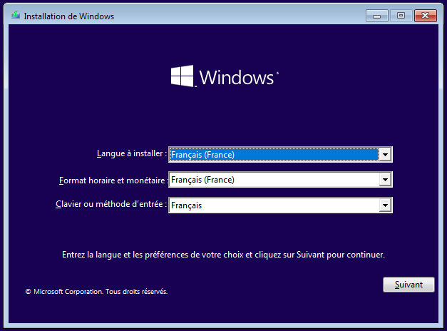
:::
::: code-group-item Etape 2
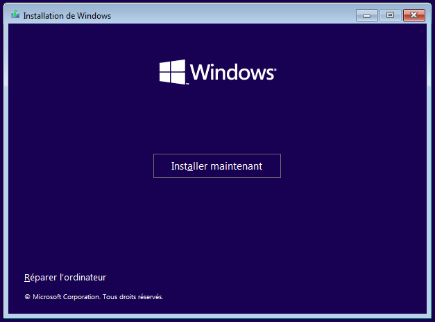
:::
::: code-group-item Etape 3
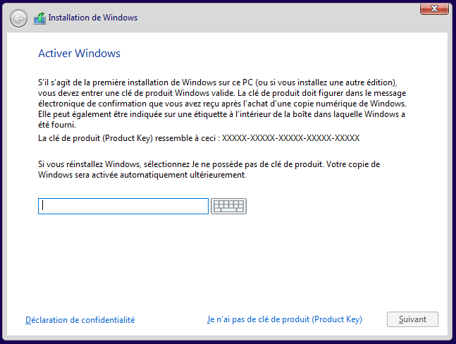
:::
::: code-group-item Etape 4
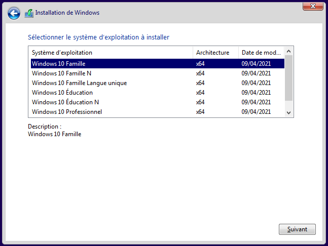
:::
::: code-group-item Etape 5
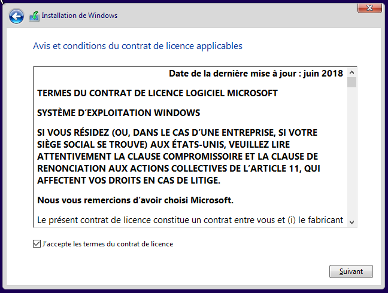
:::
::: code-group-item Etape 6

:::
::: code-group-item Etape 7
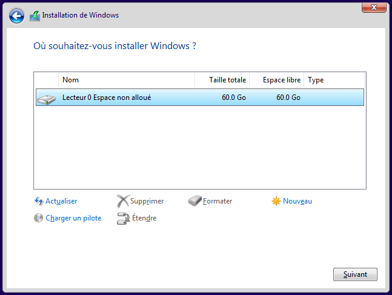
:::
::: code-group-item Etape 8
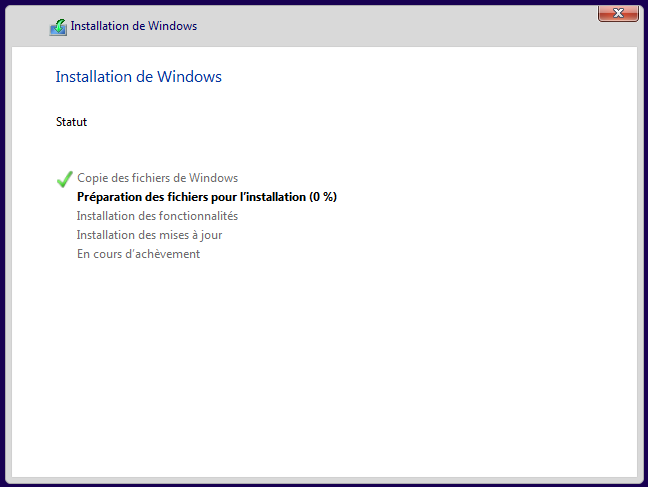
:::
::::

## Paramètres d'installation

Je ne vais pas expliquer tout le processus de paramétrage initial, mais voici le plus important : 

:::: code-group
::: code-group-item Etape 1
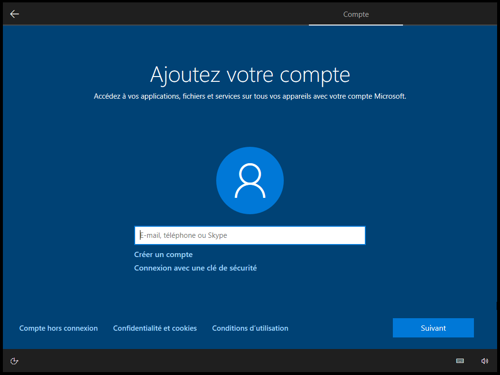
:::
::: code-group-item Etape 2
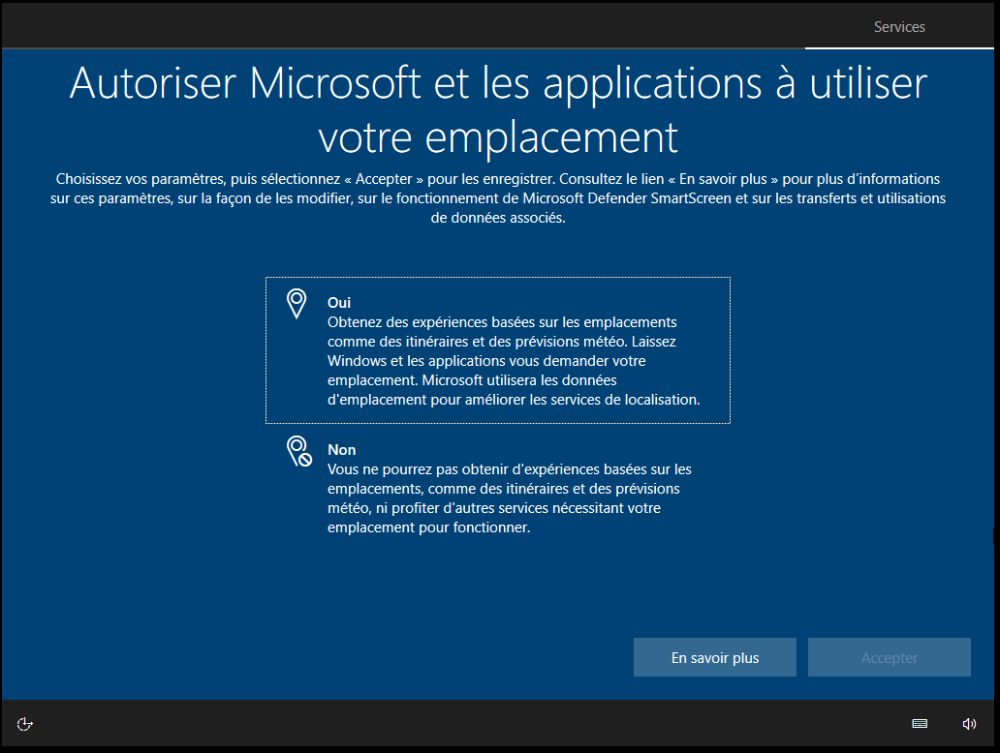
:::
::: code-group-item Etape 3
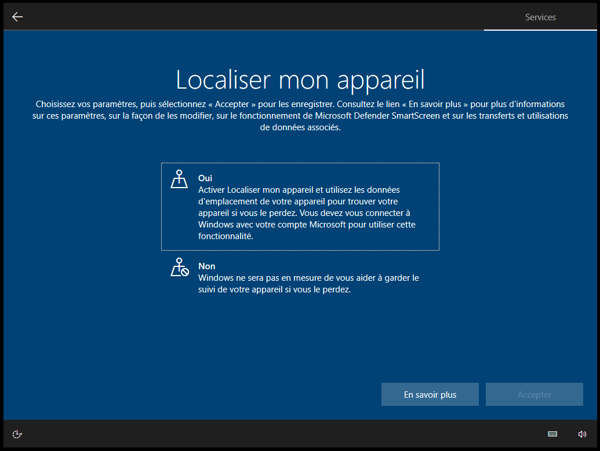
:::
::: code-group-item Etape 4
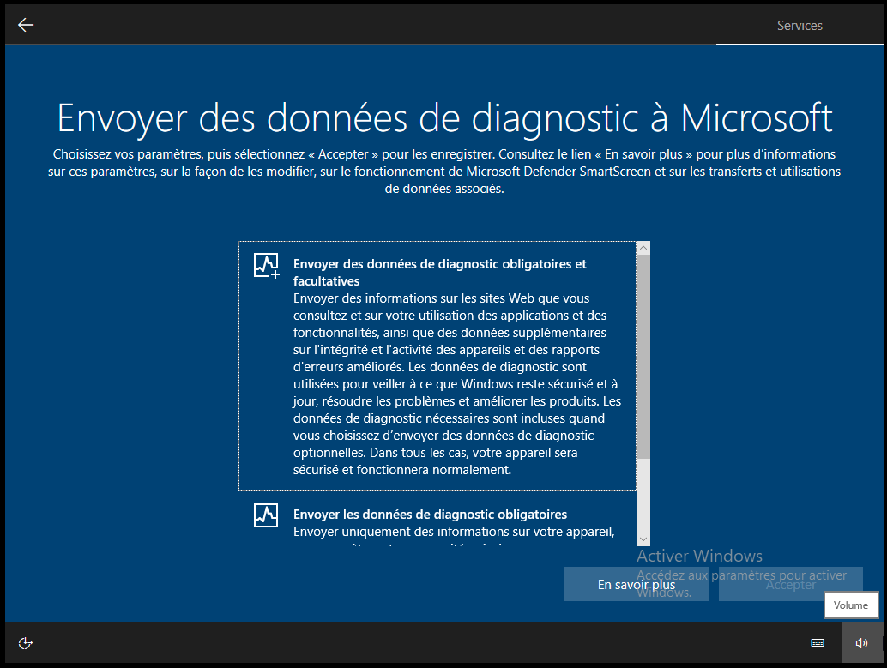
:::
::::

Voilà, Windows 10 est enfin installé 👍.